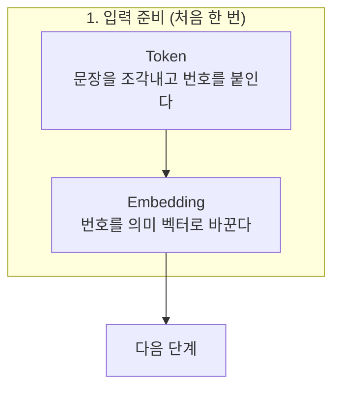

# Mermaid 작성 규칙

## 기본 문법

- 노드 라벨은 항상 큰따옴표로 감싼다. 괄호, 작은따옴표, 숫자, 한글이 섞여도 안전하다.
- 줄바꿈은 ` `를 쓴다. 한 줄은 15자 안팎으로 끊는다. 기본 상자 폭이 좁아서 길면 단어 중간에서 줄이 바뀐다.
- 화살표 라벨: `A -- "0.80" --> B` 또는 `A -->|"계산"| B`
- 점선: `A -.-> B`, 원통(저장소): `C[("KV Cache")]`, 둥근 사각형: `X(["더하기 +"])`

## 그림별 패턴

| 보여 줄 것 | 패턴 |
|---|---|
| 전체 흐름 | `flowchart TD` + 부분마다 `subgraph` |
| 내부 구조 (부품 순서와 우회 경로) | `flowchart TD`, 우회 경로는 라벨 달린 화살표 |
| 관계와 비율 | `flowchart LR`, 왼쪽에 대상들, 오른쪽에 질문하는 쪽, 화살표 라벨에 비율 |
| 여러 갈래로 나뉘었다 합쳐짐 | `flowchart LR`, 가운데 노드들을 세로로 |
| 단계별 변화 | `flowchart LR` + 단계마다 `subgraph` |
| 반복 | `flowchart TD`, 반복 화살표에 라벨 |

## 자주 생기는 문제

| 문제 | 해결 |
|---|---|
| 상자가 좁아 글자가 어색하게 끊김 | ` `로 직접 끊는다. 그래도 넓어야 하면 첫 줄에 `%%{init: {"flowchart": {"wrappingWidth": 400}}}%%` |
| 반복 화살표가 그림 전체를 가로지름 | 반복을 별도 노드로 만들거나 같은 subgraph 안의 짧은 되돌림 화살표로 바꾼다 |
| 원형 노드 `(("+"))`가 거대하게 그려짐 | `(["더하기 +"])` 둥근 사각형으로 바꾼다 |
| 긴 점선 라벨이 그림을 가림 | 설명은 노드 안이나 그림 아래 본문으로 옮긴다 |
| 가로로 너무 긴 LR 그림 | 노드가 4개를 넘으면 TD로 바꾼다 |
| 업로드할 위키가 Mermaid를 지원하지 않음 | 렌더링한 PNG를 넣는다 |

## 렌더링 확인

문법 오류만이 아니라 보기 좋은지도 확인해야 한다. `scripts/render_mermaid.sh 문서.md 출력폴더`로 문서 안의 모든 Mermaid 블록을 PNG로 만든 뒤 하나씩 열어 본다.

- mermaid-cli(`@mermaid-js/mermaid-cli`)가 필요하다. 없으면 스크립트가 임시 폴더에 설치한다.
- 브라우저가 따로 설치된 환경이면 `PUPPETEER_EXECUTABLE_PATH`에 경로를 지정한다. 예: `/opt/pw-browsers/chromium-*/chrome-linux/chrome`
