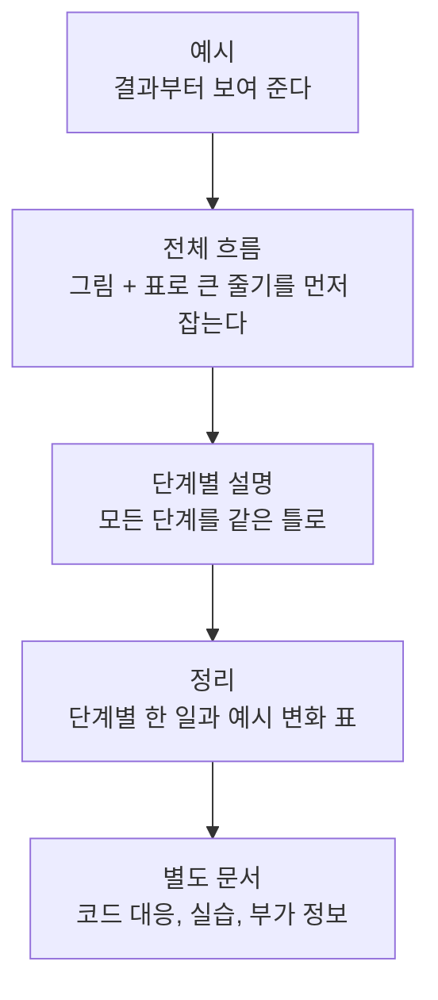
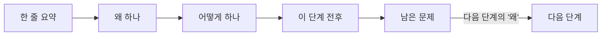

# 개념 설명 문서 작성 가이드

복잡한 기술 개념을 조사하고 일반인도 따라올 수 있는 문서로 정리할 때 쓰는 기준이다. LLM 동작 원리 문서(llm-transformer-wiki.md)를 만들며 정한 방식을 일반화했다. 맨 아래에 그대로 붙여 쓰는 프롬프트가 있다.

같은 내용을 Claude 스킬로 만들어 .claude/skills/concept-explainer/에 두었다. 이 저장소에서 Claude Code를 쓰면 개념 설명 문서를 요청할 때 자동으로 적용된다.

---

## 1. 목표

- 독자가 용어를 외우는 것이 아니라 데이터나 상황이 단계마다 어떻게 바뀌는지 따라가며 이해하게 한다.
- 문서만 읽어도 이해되어야 한다. 발표 대본은 문서를 보조할 뿐이다.
- 본질에 집중한다. 역사, 비교표, 세부 변형, 코드, 실습 같은 부가 정보는 별도 문서로 뺀다.

---

## 2. 문서 구조



| 순서 | 구성 | 내용 |
|---|---|---|
| 1 | 예시 | 하나의 구체적인 상황을 보여 주고 이 결과가 어떻게 나오는지를 문서의 질문으로 삼는다 |
| 2 | 전체 흐름 | 단계 목록을 Mermaid 흐름도로 보여 주고 단계를 2~4개 부분으로 묶어 표로 설명한다 |
| 3 | 단계별 설명 | 아래 4장의 고정 틀을 모든 단계에 똑같이 적용한다 |
| 4 | 정리 | 단계, 한 일, 예시에서 달라진 것을 한 표로 모은다. 마지막에 전체를 한 문장으로 요약한다 |
| 5 | 별도 문서 | 본문에서 뺀 코드 대응, 실습, 심화 내용을 모은다 |

---

## 3. 예시 고르기

- 처음부터 끝까지 하나의 예시만 쓴다. 단계가 바뀌어도 같은 예시가 어떻게 변하는지 보여 준다.
- 헷갈릴 만한 후보를 일부러 넣는다. 정답 후보만 있으면 각 단계가 무엇을 가려내는지 보이지 않는다.
  - 예: '민수는 사과를 좋아해'만 쓰는 대신 '민수는 사과를 좋아하고 지수는 포도를 좋아해'를 쓴다. 그래야 단계마다 지수가 아니라 민수, 포도가 아니라 사과를 고르는 과정이 드러난다.
- 예시 안에 단계마다 해결해야 할 문제가 하나씩 들어 있게 만든다. 순서가 중요한 부분, 멀리 떨어진 정보, 여러 번 건너야 이어지는 관계 등.
- 필요하면 대화 턴이나 문장을 늘린다. 단, 각 추가 요소가 어느 단계를 설명하기 위한 것인지 분명해야 한다.

---

## 4. 단계별 고정 틀

모든 단계를 아래 순서로 쓴다. 한 단계의 남은 문제가 다음 단계의 이유가 되도록 이어 붙인다.



| 항목 | 쓰는 법 |
|---|---|
| 한 줄 요약 | 인용 블록(>) 한두 문장. 이 단계가 하는 일을 결론부터 말한다 |
| 왜 하나 | 이 단계가 없으면 무엇이 안 되는지 서술형 문단으로 쓴다. 가능하면 예시로 보여 준다 |
| 어떻게 하나 | 실제 방법을 순서대로. 숫자 예시, 표, 그림을 함께 쓴다 |
| 이 단계 전후 | 전과 후를 비교하는 표. 같은 예시가 어떻게 달라졌는지 보여 준다 |
| 남은 문제 | 아직 해결되지 않은 것과 그것을 다음 단계가 해결한다는 연결 |

---

## 5. 정확성 규칙

- 단순화는 해도 틀린 말은 하지 않는다. 실제와 다른 단순화는 짧게 설명용이라고 밝힌다.
- 숫자 예시는 직접 계산해서 맞춘다. 비율 합, 확률 합, 내적, 정규화 결과가 실제 계산과 일치해야 한다.
- 문서 처음에 숫자가 설명용 값이라는 것을 한 번 밝힌다.
- 앞에서 세운 규칙을 뒤의 예시가 어기지 않는지 확인한다.
  - 예: 앞쪽만 본다고 설명해 놓고 뒤에 올 단어의 정보를 이미 아는 것처럼 쓰면 안 된다.
- 예시에 쓴 값이 사람이 정한 값인지, 실제 측정값인지, 학습으로 정해지는 값인지 구분해서 적는다.
- 확인할 수 있는 사실(설정값, 코드 줄 번호, 실제 도구 출력)은 직접 확인한 뒤 쓴다. 확인하지 못한 링크나 주장은 그렇다고 밝힌다.
- 독자가 오해하기 쉬운 지점을 미리 짚는다. 단 Q&A 형식이 아니라 본문 설명 안에 한두 문장으로 녹인다.
  - 예: 위치 정보를 설명하며 위치가 가깝다고 자동으로 더 참고하는 것은 아니라는 문장을 함께 쓴다.

---

## 6. 문체

### 기본

- 해라체 평서문(~다)으로 쓴다.
- 결론부터 쓰는 두괄식으로 쓴다.
- 문장은 짧게 쓰고 한 문장에 정보 하나를 담는다.
- 이유와 과정은 서술형 문단으로 쓴다. 개조식은 나열 자체가 의미 있을 때만 쓴다.

### 쓰지 않는 것

| 쓰지 않는 것 | 예 | 대신 |
|---|---|---|
| 굵은 글씨 강조 | \*\*핵심\*\* | 문장 순서와 표로 강조 |
| 큰따옴표 강조 | "중요한" 단계 | 따옴표 없이 쓰기 |
| 긴 줄표 | A — B | 쉼표, 괄호, 문장 분리 |
| 연결어미 뒤 쉼표 | 바꾸고, 더한다 | 바꾸고 더한다 |
| 명사형 종결 남발 | 정보 없음. 해결함. | 정보가 없다. 해결한다. |
| 장 번호 참조 | (이유는 4장) | 그 자리에서 짧게 설명하거나 생략 |
| AI 관용구 | ~하는 셈이다, 핵심은 ~이다, 결국, 잠깐, 단순한 X를 넘어 | 직접 서술 |
| 비유 남발 | 고속도로가 생기는 셈이다 | 실제로 일어나는 일을 그대로 쓰기 |
| Q&A 형식 | Q. ~인가? A. ~다 | 본문 설명에 녹이기 |

### 허용하는 것

- 예시 속 단어나 Token을 가리킬 때 작은따옴표를 쓴다. 예: '사과', '그 사람'
- 비유는 꼭 필요할 때 한 줄 이내로 쓴다.

---

## 7. 용어 설명

- 일반인이 모를 만한 용어와 약어는 처음 나오는 곳 바로 아래에 작은 글씨로 설명한다.
- 형식: 용어(풀네임, 한글명): 한 줄 정의

```html
<sub>Token(토큰): 모델이 글을 처리하는 단위. 단어 하나일 수도 있고 조사 하나일 수도 있다<br>
Softmax(소프트맥스): 점수 목록을 0~1 사이, 합이 1인 비율로 바꾸는 함수</sub>
```

- 같은 용어는 두 번 설명하지 않는다.
- 본문 첫머리에 나오는 핵심 용어(예: LLM, Token, 벡터)도 빠짐없이 설명한다.

---

## 8. 시각 자료

### 언제 무엇을 쓰나

| 보여 줄 것 | 형식 |
|---|---|
| 전체 단계 흐름 | Mermaid flowchart TD + subgraph로 부분 묶기 |
| 한 단계의 내부 구조 | Mermaid flowchart TD |
| 관계와 비율 (A가 B를 얼마나 참고하나) | Mermaid flowchart LR + 화살표 라벨에 숫자 |
| 반복 과정 | Mermaid flowchart TD |
| 전후 비교, 수치 변화, 단계 요약 | 표 |
| 계산 과정 | text 코드 블록 |

### Mermaid 작성 규칙

- 노드 라벨은 항상 큰따옴표로 감싼다. 예: `A["Token<br/>문장을 조각낸다"]`
- 한 줄은 15자 안팎으로 끊고 `<br/>`로 줄을 바꾼다. 길면 상자 폭이 좁아 글자가 어색하게 끊긴다.
- 화살표가 그림을 가로지르지 않게 한다. 반복은 별도 노드나 짧은 되돌림 화살표로 표현한다.
- 원형 노드 `(("+"))`는 크게 그려지므로 `(["더하기 +"])`처럼 둥근 사각형을 쓴다.
- 꼭 필요하면 `%%{init: {"flowchart": {"wrappingWidth": 400}}}%%`로 상자 폭을 넓힌다.
- 렌더링을 실제로 확인한다. mermaid-cli로 PNG를 만들어 눈으로 본다.

```bash
npm install @mermaid-js/mermaid-cli
npx mmdc -i diagram.mmd -o diagram.png -b white
```

- 업로드할 위키가 Mermaid를 지원하는지 확인한다. 지원하지 않으면 PNG로 바꿔 넣는다.

---

## 9. 발표 대본

- 문서와 같은 순서로 쓴다.
- 화면을 바꿀 지점에 `[화면] 띄울 부분`을 적는다.
- 문서의 작은 글씨 용어 설명을 처음 나오는 자리에서 말로 풀어 넣는다. 그대로 읽으면 되도록 한다.
- 표와 그림은 다 읽지 않고 핵심 숫자 한두 개만 말한다.
- 합니다체로 쓰고 한 문장에 정보 하나만 담는다.
- 예상 발표 시간을 맨 위에 적는다.

---

## 10. 완성 전 점검

- [ ] 예시 하나로 처음부터 끝까지 이어지는가
- [ ] 큰 줄기(그림 + 표)가 단계 설명보다 먼저 나오는가
- [ ] 모든 단계가 한 줄 요약 / 왜 / 어떻게 / 전후 / 남은 문제 틀을 따르는가
- [ ] 각 단계의 남은 문제가 다음 단계의 이유로 이어지는가
- [ ] 숫자 예시를 직접 계산해 확인했는가
- [ ] 앞에서 세운 규칙을 뒤의 예시가 어기지 않는가
- [ ] 모든 전문 용어가 처음 나오는 곳에 작은 글씨로 설명되어 있는가
- [ ] 쓰지 않기로 한 표현(굵은 글씨, 큰따옴표, 긴 줄표, 연결어미 뒤 쉼표, Q&A)이 없는가
- [ ] Mermaid 그림을 실제로 렌더링해 확인했는가
- [ ] 부가 정보를 본문에서 뺐는가
- [ ] 대본이 문서와 같은 순서이고 용어 설명을 포함하는가

자동 점검 예시

```bash
# 연결어미 뒤 쉼표
grep -noE '[가-힣]+(고|며|면|서|지만|면서|라면),' 문서.md
# 굵은 글씨, 긴 줄표
grep -nE '\*\*|—' 문서.md
```

---

## 11. 재사용 프롬프트

아래를 복사해 주제와 독자만 바꿔 쓴다.

```text
다음 주제를 설명하는 문서를 만들어 줘.

주제: {예: Kubernetes에서 Pod가 생성되어 트래픽을 받기까지}
독자: {예: 개발 경험이 없는 사내 직원}
결과물: 사내 위키용 .md 1개, 그대로 읽는 발표 대본 .md 1개, 부가 정보(코드, 실습, 심화)용 .md 1개

구성
1. 처음에 구체적인 예시 하나를 보여 주고 그 결과가 어떻게 나오는지를 문서의 질문으로 삼아. 예시에는 헷갈릴 만한 후보를 넣어서 각 단계가 무엇을 가려내는지 보이게 해.
2. 전체 흐름을 Mermaid 흐름도와 표로 먼저 보여 줘. 단계를 2~4개 부분으로 묶어.
3. 모든 단계를 같은 틀로 써: 한 줄 요약(인용 블록) / 왜 하나(서술형) / 어떻게 하나(숫자 예시, 표, 그림) / 이 단계 전후(표) / 남은 문제(다음 단계로 연결).
4. 마지막에 단계, 한 일, 예시에서 달라진 것을 한 표로 정리하고 전체를 한 문장으로 요약해.
5. 역사, 비교, 코드, 실습 같은 부가 정보는 별도 문서로 빼.

정확성
- 단순화는 해도 틀린 말은 하지 마. 단순화한 부분은 설명용이라고 밝혀.
- 숫자 예시는 직접 계산해서 맞춰. 앞에서 세운 규칙을 뒤의 예시가 어기지 않게 해.
- 예시 값이 사람이 정한 값인지 학습이나 측정으로 정해지는 값인지 구분해.
- 확인 가능한 사실은 확인하고 쓰고 확인하지 못한 것은 밝혀.
- 독자가 오해하기 쉬운 지점은 Q&A가 아니라 본문 안에서 한두 문장으로 짚어.

문체
- 해라체 평서문, 두괄식, 짧은 문장. 이유와 과정은 서술형 문단으로.
- 굵은 글씨, 큰따옴표 강조, 긴 줄표, 연결어미 뒤 쉼표, 명사형 종결 남발, 장 번호 참조, AI 관용구, 비유 남발, Q&A 형식은 쓰지 마.
- 예시 속 단어는 작은따옴표로 구분해도 돼.
- 전문 용어와 약어는 처음 나올 때 바로 아래에 <sub>용어(풀네임, 한글명): 한 줄 정의</sub>로 설명해.

시각 자료
- 흐름, 구조, 관계, 반복은 Mermaid로. 전후 비교와 수치 변화는 표로.
- Mermaid 라벨은 큰따옴표로 감싸고 15자 안팎에서 <br/>로 줄을 바꿔. 렌더링해서 확인해.

대본
- 문서와 같은 순서, [화면] 표시, 합니다체, 용어 설명을 말로 포함해서 그대로 읽으면 되게.
```
