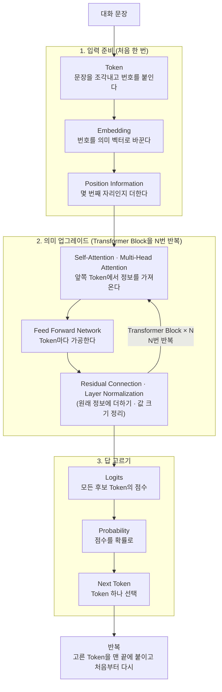
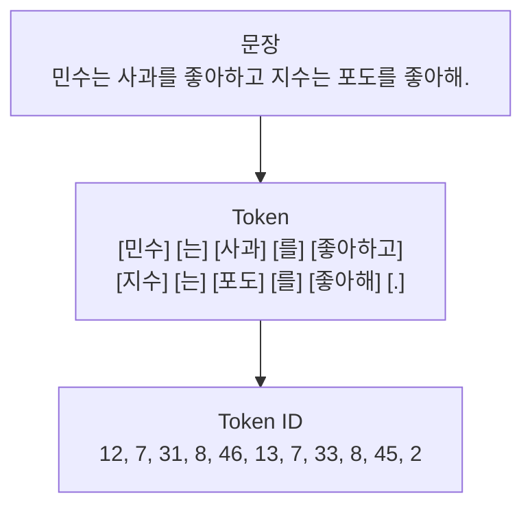
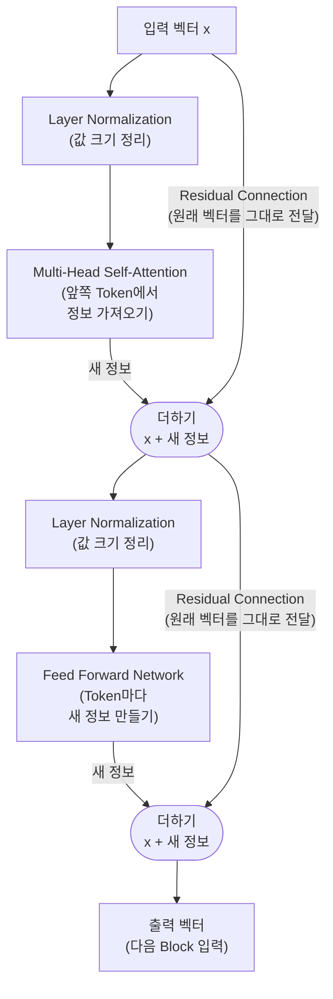
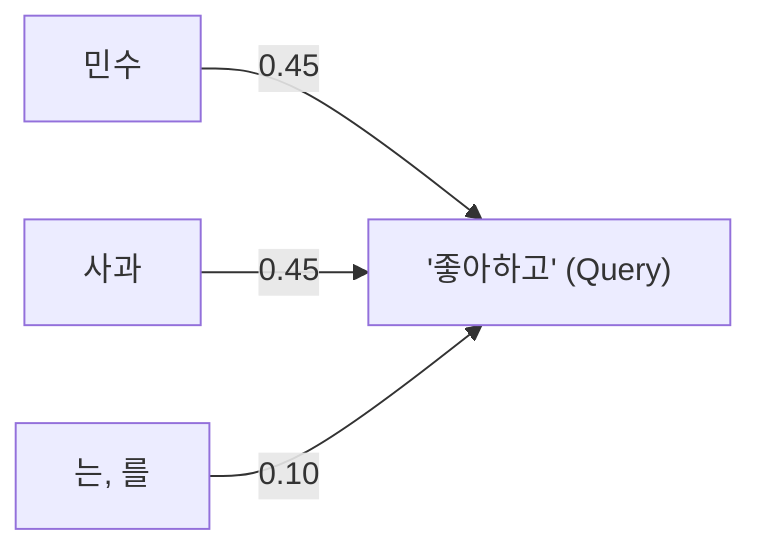
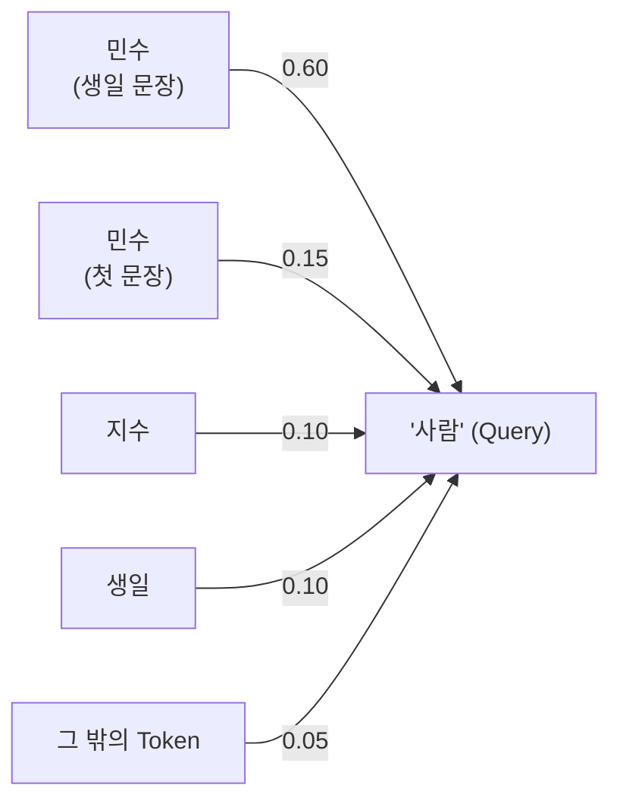
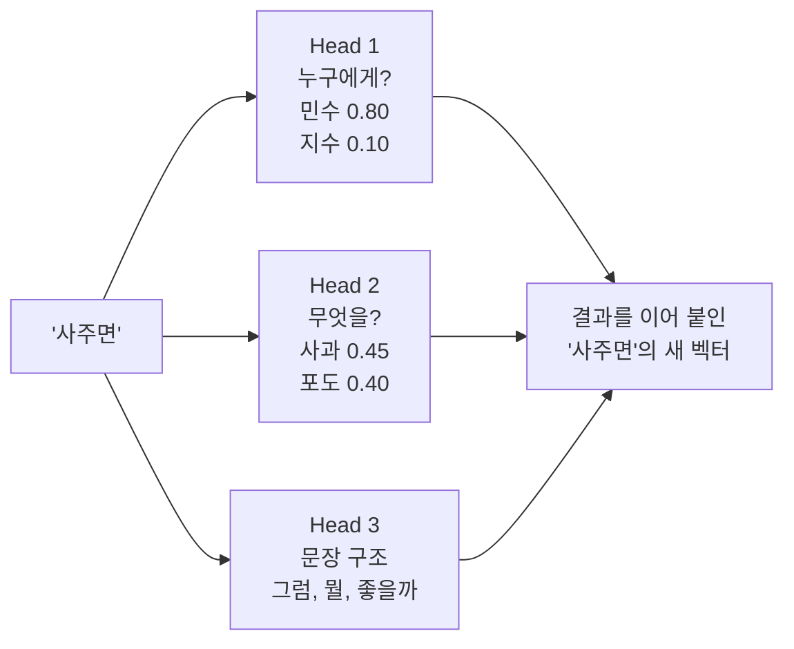
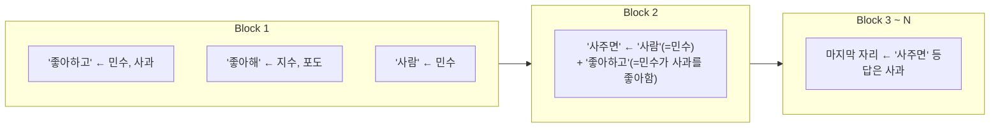
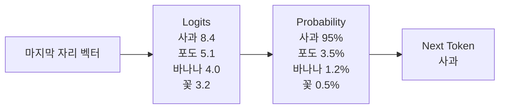
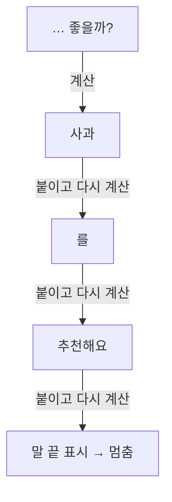
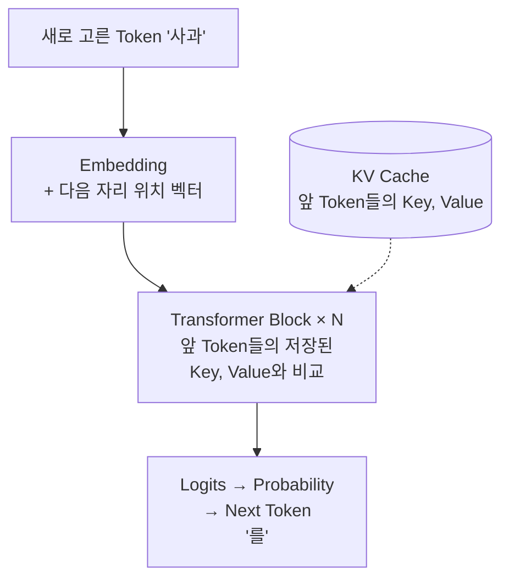

# LLM 동작 원리

## 예시 대화

```text
사용자: 민수는 사과를 좋아하고 지수는 포도를 좋아해.
AI:     두 사람의 취향이 다르네요.

사용자: 다음 주가 민수 생일이야.
AI:     생일 선물을 준비하시는군요.

사용자: 그럼 그 사람에게 뭘 사주면 좋을까?
AI:     사과를 추천해요.
```

마지막 질문에는 '민수'도 '사과'도 나오지 않는다. 그런데 모델은 세 가지를 연결해서 답한다.

| 질문 속 표현 | 모델이 찾아낸 것 | 근거가 된 앞 대화 |
|---|---|---|
| 그 사람 | 민수 | 다음 주가 민수 생일이야 |
| 뭘 사주면 | 민수가 좋아하는 것 | 민수는 사과를 좋아하고 |
| 답 | 사과 (포도가 아님) | 포도를 좋아하는 사람은 지수 |

이 문서는 문장이 모델에 들어가서 '사과'라는 답이 나오기까지 어떤 단계를 거치는지, 단계마다 무엇이 바뀌는지를 따라간다. 문서 속 번호, 벡터, 비율, 확률은 이해를 돕기 위해 만든 설명용 값이다.

<sub>LLM(Large Language Model, 대규모 언어 모델): 많은 글을 학습해서 주어진 글 다음에 올 말을 예측하는 모델<br>
Token(토큰): 모델이 글을 처리하는 단위. 단어 하나일 수도 있고 글자 몇 개나 조사 하나일 수도 있다<br>
벡터: 숫자 여러 개를 한 줄로 묶은 값. 예: [0.9, 0.8, 0.1]<br>
Transformer(트랜스포머): 2017년 발표된 신경망 구조. 현재 LLM 대부분의 기반<br>
가중치: 신경망 안에서 곱해지는 숫자들. 처음엔 무작위 값이고 학습으로 정해진다</sub>

---

## 전체 흐름

LLM이 하는 일은 한 문장으로 말하면 지금까지의 글을 보고 다음에 올 Token 하나를 고르는 것이다. 이 일을 답이 끝날 때까지 반복한다. Token 하나를 고르는 과정은 크게 세 부분으로 나뉜다.



| 부분 | 단계 | 이 부분이 하는 일 |
|---|---|---|
| 1. 입력 준비 | Token, Embedding, Position Information | 글자를 모델이 계산할 수 있는 벡터로 바꾼다. 처음에 한 번만 한다 |
| 2. 의미 업그레이드 | Self-Attention, Multi-Head Attention, Feed Forward Network, Residual Connection, Layer Normalization, Transformer Block × N | 각 Token의 벡터에 앞 대화의 문맥을 계속 쌓아 의미를 업그레이드한다 |
| 3. 답 고르기 | Logits, Probability, Next Token | 업그레이드된 마지막 자리의 벡터로 다음 Token 하나를 고른다 |
| 반복 | | 고른 Token을 붙이고 다시 계산해 답을 한 Token씩 늘려 간다 |

### 질문 이해와 답 생성은 같은 계산이다

LLM에는 질문을 이해하는 장치와 답을 만드는 장치가 따로 있지 않다. 위 1~3 전체가 Token 하나를 고르는 계산 한 번이고 이 계산을 반복하는 것이 전부다. 다만 첫 번째 계산과 그 뒤의 계산은 처리하는 양이 다르다.

| 계산 | 처리하는 Token | 결과 |
|---|---|---|
| 첫 번째 | 질문을 포함한 대화 전체를 한꺼번에 | 모든 자리의 벡터가 업그레이드되고 답의 첫 Token '사과'가 나온다 |
| 두 번째 | 새로 붙은 '사과' 하나 | 앞 자리들의 계산 결과를 다시 쓰고 다음 Token '를'이 나온다 |
| 세 번째 이후 | 새로 붙은 Token 하나씩 | 말 끝 표시가 나올 때까지 반복한다 |

흔히 질문을 이해한다고 말하는 부분은 첫 번째 계산에서 대화 속 모든 자리의 벡터가 문맥을 담도록 업그레이드되는 과정이다. 이 업그레이드도 다음 Token을 잘 고르기 위해 일어난다.

<sub>Prefill(프리필): 첫 번째 계산처럼 입력 전체를 한꺼번에 처리하는 단계<br>
Decode(디코드): 그 뒤 Token을 하나씩 만들어 붙이는 단계</sub>

### 전체 과정을 한 문단으로

사용자가 질문을 보내면 LLM은 앞 대화와 새 질문을 이어 붙여 Token으로 자르고 사전 번호를 붙인다. 번호마다 의미를 담은 벡터를 꺼내고 몇 번째 자리인지를 더한다. 이 벡터들은 Transformer Block을 여러 번 지난다. Block마다 각 Token은 앞쪽 Token들과 관련도를 계산해 필요한 정보를 비율대로 가져오고 가져온 정보를 조합해 새 정보를 만든다. 새 정보는 원래 벡터에 더해 쌓고 계산 전마다 값의 크기를 맞춘다. Block을 모두 지나면 마지막 자리 벡터에 대화의 맥락이 모인다. 이 벡터로 사전 속 모든 Token의 점수를 내고 확률로 바꾼 뒤 Token 하나를 고른다. 고른 Token을 입력 끝에 붙여 다시 계산하는 일을 말 끝 표시가 나올 때까지 반복하면 고른 Token들이 이어져 최종 문장이 된다.

| 과정 | 이 단계에서 일어나는 일 |
|---|---|
| 사용자 입력 | 앞 대화 전체와 새 질문이 함께 입력이 된다 |
| Tokenizer → Token ID | 문장을 Token으로 자르고 사전 번호를 붙인다 |
| Embedding | 번호마다 의미를 담은 벡터를 꺼낸다 |
| Position Information | 몇 번째 자리인지를 벡터에 더한다 |
| Transformer Block × N | 아래 네 가지를 묶어 정해진 횟수만큼 반복한다 |
| ├ Layer Normalization | 계산에 넣기 전에 값의 크기를 맞춘다 |
| ├ Self-Attention (Multi-Head) | 앞쪽 Token과 관련도를 계산해 필요한 정보를 비율대로 가져온다. 여러 관점으로 동시에 한다 |
| ├ Feed Forward Network | 가져온 정보를 조합해 새 정보를 만든다 |
| └ Residual Connection | 새 정보를 원래 벡터에 더해 쌓는다 |
| Logits | 마지막 자리 벡터로 사전 속 모든 Token의 점수를 낸다 |
| Probability Distribution | 점수를 확률로 바꾼다. Temperature로 1등에 얼마나 쏠릴지 조절한다 |
| 다음 Token 선택 | 확률을 보고 Token 하나를 고른다 |
| 다시 입력에 붙임, 반복 | 고른 Token을 끝에 붙이고 다시 계산한다 |
| 최종 문장 | 말 끝 표시가 나오면 멈추고 고른 Token들을 글자로 바꿔 보여 준다 |

아래에서는 각 단계를 왜 하는지, 어떻게 하는지, 그 결과 무엇이 달라지는지, 어떤 문제가 남아 다음 단계로 넘어가는지 순서로 설명한다. 단계마다의 전후 변화는 맨 끝 정리에 한 표로 모았다.

---

# 1. 입력 준비

## 1-1. Token

> 문장을 Token이라는 조각으로 자르고 각 조각에 사전 번호(Token ID)를 붙인다.

### 왜 하나

컴퓨터 안의 신경망은 숫자만 계산할 수 있다. 그래서 글자를 숫자로 바꿔야 한다. 그런데 문장 전체에 번호를 붙이면 세상의 모든 문장마다 번호가 필요해서 끝이 없다. 그래서 문장을 자주 반복되는 조각으로 자르고 조각마다 번호를 붙인다. 이렇게 하면 정해진 개수의 조각만으로 어떤 문장이든 표현할 수 있다.

### 어떻게 하나

많은 글을 미리 살펴보고 자주 붙어 나오는 글자 조합을 하나의 Token으로 등록해 사전을 만든다. 이 사전은 모델을 학습하기 전에 한 번 만들어 두고 이후에는 바꾸지 않는다.

| 사전 만드는 과정 | 사전에 있는 Token |
|---|---|
| 처음 | 글자 하나하나(정확히는 바이트): 좋, 아, 해, 사, 과 … |
| '좋'과 '아'가 가장 자주 붙어 나옴 | 좋, 아, 해, 사, 과 … + 좋아 |
| '좋아'와 '해'가 자주 붙어 나옴 | 좋, 아, 해, 사, 과 … + 좋아 + 좋아해 |
| 정한 크기가 될 때까지 반복 | 수만~수십만 개 (GPT-2는 50,257개) |

합친 Token은 새로 추가되고 원래 조각은 사전에 그대로 남는다. 그래서 '좋아해'는 한 Token으로 처리하면서도 '좋은' 같은 다른 단어에는 '좋' 조각을 쓸 수 있다. 문장을 자를 때는 사전을 만들 때 배운 합치기 순서를 그대로 적용한다. 그래서 자주 나오는 조합은 큰 조각 하나로, 드문 단어는 작은 조각 여러 개로 나뉜다.



| Token | 민수 | 는 | 사과 | 를 | 좋아하고 | 지수 | 는 | 포도 | 를 | 좋아해 | . |
|---|---|---|---|---|---|---|---|---|---|---|---|
| Token ID | 12 | 7 | 31 | 8 | 46 | 13 | 7 | 33 | 8 | 45 | 2 |

- '는'과 '를'은 두 번씩 나오지만 매번 같은 번호(7, 8)를 받는다. 번호는 어떤 Token인지만 나타내고 몇 번째인지는 담지 않는다.
- 설명을 위해 단어와 조사 단위로 잘랐다. 실제 Tokenizer는 단어가 아니라 위 방식으로 만든 조각 단위로 자른다.
- 세 번의 대화는 모두 이어 붙여 하나의 긴 Token 목록으로 들어간다. 모델은 앞 대화를 따로 기억해 두지 않는다. 질문할 때마다 앞 대화 전체를 다시 이어 붙여 넣는다. 실제로 모델에 전달되는 입력에는 화자를 구분하는 표시와 AI가 답할 차례라는 표시가 함께 붙는다. 이 표시들도 사전에 있는 특수 Token이다. 아래 표시 이름은 설명용이고 실제 이름과 모양은 모델마다 다르다.

```text
[사용자] 민수는 사과를 좋아하고 지수는 포도를 좋아해. [끝]
[AI] 두 사람의 취향이 다르네요. [끝]
[사용자] 다음 주가 민수 생일이야. [끝]
[AI] 생일 선물을 준비하시는군요. [끝]
[사용자] 그럼 그 사람에게 뭘 사주면 좋을까? [끝]
[AI]      ← 마지막 자리. 여기서부터 답을 만든다
```

- 이 문서에서 '마지막 자리'라고 부르는 곳이 맨 끝 [AI] 표시의 자리다.

<sub>특수 Token: 글자가 아니라 역할을 나타내는 Token. 화자 구분, 말 끝 표시 등에 쓴다</sub>

### 이 단계 전후

| | 전 | 후 |
|---|---|---|
| 형태 | 글자 | 숫자 목록 |
| 모델이 계산할 수 있나 | 없다 | 있다 |
| 뜻을 담고 있나 | 사람에게는 있다 | 없다. 번호일 뿐이다 |

### 남은 문제

번호에는 뜻이 없다. 사과(31)와 포도(33)의 번호가 가까운 것은 우연이고 바나나는 9137일 수도 있다. 번호만으로는 '사과와 포도는 둘 다 과일'이라는 것을 알 수 없다. 다음 단계에서 번호를 뜻을 담을 수 있는 벡터로 바꾼다.

<sub>Token ID: 각 Token에 붙은 사전 번호<br>
Tokenizer(토크나이저): 문장을 Token으로 자르고 번호를 붙이는 도구<br>
BPE(Byte Pair Encoding): 자주 붙어 나오는 글자 쌍을 반복해서 합쳐 Token 사전을 만드는 방법. 대부분의 LLM이 쓴다</sub>

---

## 1-2. Embedding

> Token 번호를 숫자 여러 개로 된 벡터로 바꾼다. 비슷하게 쓰이는 Token은 비슷한 벡터를 갖는다.

### 왜 하나

번호 하나로는 비교도 섞기도 할 수 없다. 뒤에 나올 단계들은 Token끼리 얼마나 관련 있는지 비교하고 여러 Token의 정보를 비율대로 섞는 계산을 한다. 이런 계산을 하려면 Token을 여러 숫자로 된 벡터로 나타내야 한다.

### 어떻게 하나

사전의 Token 수만큼 줄이 있는 표(Embedding 표)를 둔다. Token 번호가 들어오면 그 번호에 해당하는 줄을 꺼낸다. 표의 값은 처음엔 무작위 숫자다. 학습하면서 비슷한 자리에 자주 쓰이는 Token끼리 벡터가 가까워지도록 조금씩 고쳐진다.

| Token | 번호 | 벡터 (3칸으로 줄인 예) |
|---|---|---|
| 민수 | 12 | [0.1, 0.2, 0.9] |
| 지수 | 13 | [0.2, 0.1, 0.9] |
| 사과 | 31 | [0.9, 0.8, 0.1] |
| 포도 | 33 | [0.8, 0.9, 0.2] |

표의 3칸 값은 설명을 위해 사람이 정한 값이다. 첫째와 둘째 칸은 과일 쪽, 셋째 칸은 사람 쪽 성질이 크도록 만들었다. 실제 모델은 768칸 이상이고 값은 모두 학습으로 정해진다. 칸 하나가 뜻 하나를 맡는 경우는 드물고 여러 칸의 조합이 뜻을 나타낸다. 칸이 여러 개인 이유는 숫자 하나로는 한 가지 정도만 나타낼 수 있기 때문이다. 칸이 많으면 사과와 포도처럼 과일이라는 점은 비슷하면서 색이나 맛은 다른 관계도 함께 담을 수 있다.

두 벡터가 얼마나 비슷한지는 내적으로 잰다. 같은 칸끼리 곱해서 모두 더한 값이고 클수록 비슷하다.

| 비교 | 계산 | 결과 |
|---|---|---|
| 사과 · 포도 | 0.9×0.8 + 0.8×0.9 + 0.1×0.2 | 1.46 (비슷함) |
| 민수 · 지수 | 0.1×0.2 + 0.2×0.1 + 0.9×0.9 | 0.85 (비슷함) |
| 사과 · 민수 | 0.9×0.1 + 0.8×0.2 + 0.1×0.9 | 0.34 (다름) |

벡터는 섞을 수도 있다. 민수 벡터 70%와 사과 벡터 30%를 섞으면 아래처럼 두 정보가 함께 담긴 벡터가 된다. 번호로 같은 계산을 하면 0.7×12 + 0.3×31 = 17.7이 되어 아무 의미 없는 숫자가 나온다.

```text
[0.1, 0.2, 0.9] × 0.7 + [0.9, 0.8, 0.1] × 0.3
= [0.07, 0.14, 0.63] + [0.27, 0.24, 0.03]
= [0.34, 0.38, 0.66]      민수 쪽에 가깝지만 사과 성분도 남아 있다
```

### 이 단계 전후

| | 전 (번호) | 후 (벡터) |
|---|---|---|
| 형태 | 숫자 1개 | 숫자 여러 개 (GPT-2는 768개) |
| 비슷함 비교 | 불가능 | 내적으로 가능 |
| 정보 섞기 | 불가능 | 비율대로 더하면 됨 |
| 값 조정 | 고정 | 학습으로 조금씩 고칠 수 있음 |

### 남은 문제

- 순서를 모른다. 벡터에는 이 Token이 몇 번째에 있는지 들어 있지 않다.
- 문맥을 모른다. '사과'는 어느 문장에 나오든 같은 벡터다. 민수가 좋아하는 사과인지, 약속에 늦어서 하는 사과(사죄)인지 구분하지 못한다.
- 순서는 다음 단계인 Position Information이 해결하고 문맥은 Self-Attention이 해결한다.

<sub>Embedding(임베딩): Token 번호를 벡터로 바꾸는 표<br>
차원: 벡터 하나에 든 숫자의 개수. 위 예는 3차원이고 GPT-2는 768차원<br>
내적: 두 벡터의 같은 칸끼리 곱해서 모두 더한 값. 방향이 비슷할수록 크다</sub>

---

## 1-3. Position Information

> 각 Token 벡터에 몇 번째 자리인지 나타내는 위치 벡터를 더한다.

### 왜 하나

뒤에 나올 Self-Attention은 문장을 앞에서부터 한 단어씩 읽지 않고 모든 Token을 한꺼번에 본다. 그 덕분에 멀리 떨어진 정보도 흐려지지 않고 바로 가져올 수 있다. 대신 한꺼번에 보기 때문에 순서 정보가 사라진다. 위치 정보가 없으면 모델 눈에는 아래 문장들이 똑같아 보인다.

| 문장 | 위치 정보가 없을 때 모델이 보는 것 |
|---|---|
| 민수는 사과를 좋아하고 지수는 포도를 좋아해 | { 민수, 지수, 사과, 포도, 는, 는, 를, 를, 좋아하고, 좋아해 } |
| 지수는 사과를 좋아하고 민수는 포도를 좋아해 | 위와 똑같은 묶음 |
| 사람이 사과를 먹는다 / 사과가 사람을 먹는다 | 두 문장이 거의 같은 묶음 |

누가 사과를 좋아하는지는 단어들의 순서 관계에서 나온다. '민수는'이 먼저 오고 그 뒤에 '사과를 좋아하고'가 이어진다는 순서를 알아야 민수와 사과가 묶인다. 순서가 사라지면 민수가 사과를 좋아하는지 포도를 좋아하는지 알 수 없다.

참고로 Transformer 이전에 쓰던 RNN은 한 단어씩 순서대로 읽어서 순서는 알았다. 하지만 지금까지 읽은 내용을 작은 기억 하나에 계속 덮어쓰며 넘겼기 때문에 문장이 길어지면 앞 내용이 흐려졌다. Transformer는 전체를 한꺼번에 보는 방식으로 이 문제를 풀었고 그 대가로 사라진 순서는 위치 벡터로 따로 알려 준다.

### 어떻게 하나

0번 자리, 1번 자리처럼 자리마다 위치 벡터를 하나씩 정해 두고 Token 벡터에 더한다. 위치 벡터는 Token마다가 아니라 자리마다 하나다. 2번 자리에 어떤 Token이 오든 같은 2번 위치 벡터를 더한다. Token 벡터와 위치 벡터는 입력을 준비할 때 한 번에 더한다.

| | Token 벡터 | 위치 벡터 | 더한 결과 |
|---|---|---|---|
| 2번 자리의 사과 | [0.9, 0.8, 0.1] | [0.0, 0.0, 0.3] | [0.9, 0.8, 0.4] |
| 7번 자리의 사과 (두 번째 문장에 나온다면) | [0.9, 0.8, 0.1] | [0.2, 0.1, 0.0] | [1.1, 0.9, 0.1] |

### 이 단계 전후

| | 전 | 후 |
|---|---|---|
| 같은 Token이 다른 자리에 나오면 | 같은 벡터 | 다른 벡터 |
| 민수는 사과를 / 지수는 사과를 구분 | 불가능 | 가능 (각 이름 뒤에 어떤 단어가 어떤 순서로 오는지 계산 가능) |

위치 벡터를 따로 붙여 두지 않고 더하는 이유는 벡터 칸 수를 늘리지 않고 이후 계산 구조를 그대로 쓸 수 있기 때문이다. 칸이 수백 개나 되기 때문에 학습 과정에서 Token 정보와 위치 정보가 서로 다른 방향을 쓰게 되어 더해도 섞여 사라지지 않는다. 이어 붙이는 방식도 가능하지만 칸 수가 늘어나 계산이 커진다. 최근 모델이 쓰는 RoPE는 내용 벡터에는 위치를 더하지 않고 Attention에서 관련도를 계산할 때만 위치를 반영한다.

위치 정보가 있다고 가까운 Token을 자동으로 더 많이 참고하는 것은 아니다. 위치 정보는 순서와 거리를 계산할 재료일 뿐이고 실제로 얼마나 참고할지는 다음 단계에서 관련도로 정해진다.

여기까지가 입력 준비다. 이후 단계에서 자리는 바뀌지 않고 각 자리 벡터의 내용만 업그레이드된다.

### 남은 문제

각 Token은 아직 자기 정보만 안다. '좋아하고'는 누가 무엇을 좋아하는지 모르고 마지막 질문의 '그 사람'은 누구를 가리키는지 모른다. 다음 단계에서 다른 Token의 정보를 가져온다.

<sub>위치 벡터: 자리마다 하나씩 정해 둔 벡터. GPT-2는 학습으로 값을 정한다<br>
RoPE(Rotary Position Embedding, 회전 위치 임베딩): 자리 번호에 비례하는 각도로 Query와 Key 벡터를 회전시켜 위치를 표시하는 방식. 최근 LLM 다수가 쓴다<br>
RNN(Recurrent Neural Network, 순환 신경망): 입력을 순서대로 하나씩 처리하며 앞 내용을 다음 단계로 넘기는 신경망</sub>

---

# 2. 의미 업그레이드

이 부분은 Transformer Block이라는 묶음을 여러 번 반복하는 구조다. Block 하나 안에서는 아래 순서로 계산한다. 아래 설명은 각 부품을 하나씩 소개한 뒤 2-6에서 반복 구조를 다룬다.



그림에서 입력 벡터는 두 갈래로 나뉜다. 한 갈래는 Layer Normalization과 Attention을 거쳐 새 정보를 만든다. 다른 갈래는 아무 계산 없이 원래 벡터를 그대로 들고 간다. 두 갈래는 더하기에서 다시 만난다. 둘 중 하나만 하는 것이 아니라 둘 다 한 뒤 더한다. FFN 부분에서도 같은 일을 한 번 더 한다. Residual Connection은 원래 벡터를 그대로 전달해 더하는 이 갈래를 부르는 이름이다.

한 Token 자리의 벡터가 Block 하나를 지나며 겪는 일을 마지막 질문 '뭘 사주면 좋을까?'의 '사주면' 자리로 따라가면 아래와 같다. 계산이 여러 겹으로 쌓이지만 결국 원래 벡터 위에 새 정보가 두 번 더해지는 구조다.

| 순서 | 계산 | '사주면' 자리 벡터 |
|---|---|---|
| 입력 | 앞 Block의 결과 | 사주면 + 앞 Block까지 쌓인 정보 |
| Layer Normalization | 값의 크기만 맞춘다 | 내용은 그대로 |
| Multi-Head Attention | 앞쪽 Token들의 Value를 비율대로 섞어 가져온다 | 가져온 재료: Head 1은 민수, Head 2는 사과와 포도 |
| Residual Connection | 원래 벡터에 더한다 | 사주면 + 민수 + 과일 후보 |
| Layer Normalization | 값의 크기만 맞춘다 | 내용은 그대로 |
| Feed Forward Network | 재료를 조합해 새 정보를 만든다 | 생일 선물로 대상이 좋아하는 것을 고르는 상황 |
| Residual Connection | 원래 벡터에 더한다 | 사주면 + 민수 + 과일 후보 + 선물 상황 → 다음 Block으로 |

이 문서에는 반복이 두 가지 나온다. 둘을 구분해 두면 덜 헷갈린다.

| 반복 | 무엇을 반복하나 | 횟수 |
|---|---|---|
| Transformer Block × N | Token 하나를 고르기 전에 모든 자리 벡터를 업그레이드하는 일 | 모델을 설계할 때 정한 고정값. GPT-2는 12번이고 입력이 무엇이든 항상 같다 |
| 생성 반복 | Token 하나를 고르고 맨 끝에 붙이는 일 | 답이 끝날 때까지. 말 끝 표시 Token이 나오거나 최대 길이에 닿으면 멈춘다 |

## 2-1. Self-Attention

> 각 Token이 앞쪽 Token들 중 관련 있는 것을 골라 그 정보를 가져와 자기 벡터에 더한다.

### 왜 하나

Embedding까지 마친 벡터는 각 Token 자신의 정보만 담고 있다. 하지만 단어의 실제 의미는 앞뒤 문맥에서 정해진다. '사과'가 누가 좋아하는 것인지, '그 사람'이 누구인지는 앞 대화를 봐야 알 수 있다. 그래서 각 Token이 다른 Token의 정보를 가져오는 단계가 필요하다.

### 어떻게 하나

각 Token 벡터에서 역할이 다른 세 가지 벡터를 만든다.

| 벡터 | 역할 | '그 사람'의 '사람' Token 예시 |
|---|---|---|
| Query | 내가 찾는 정보 | 내가 가리키는 대상이 누구인가 |
| Key | 내가 가진 정보의 특징. 다른 Token의 Query와 비교된다 | '민수'의 Key: 사람 이름, 생일의 주인공 |
| Value | 선택됐을 때 넘겨주는 실제 정보 | '민수'의 Value: 민수에 관한 정보 |

계산은 네 단계다.

1. 각 Token이 차례로 Query가 된다.
2. 자기 Query를 앞쪽 Token들의 Key와 하나씩 비교해 관련도 점수를 낸다.
3. 점수를 합이 1인 비율로 바꾼다(Softmax).
4. 비율만큼 각 Token의 Value를 가져와 자기 벡터에 더한다.

관련도 점수는 Query와 Key의 내적이다. Query와 Key는 그 자리의 벡터에서 만들어지는데 이 벡터에는 Token의 뜻, 입력 준비 때 더한 위치, 앞 Block까지 쌓인 문맥이 이미 함께 들어 있다. 그래서 관련도에는 뜻, 위치, 문맥이 모두 반영된다. 이 단계에서 위치를 따로 더하지는 않는다. RoPE를 쓰는 모델은 이 비교 직전에 Query와 Key에 위치를 반영한다.

이 관련도 점수를 Attention Score, 비율을 Attention Weight라고 부른다. Attention은 점수 계산, 비율 변환, Value 섞기까지 전체 계산을 가리킨다.

가장 관련 높은 Token 하나만 고르는 것이 아니다. 앞쪽 모든 Token의 Value를 비율만큼 섞어서 가져온다. 비율이 큰 Token의 정보는 많이, 작은 Token의 정보는 조금 들어온다. Token끼리 짝을 지어 묶거나 단어를 만드는 것도 아니다. 결과는 그 자리 벡터에 더해지는 숫자 묶음 하나다.

다음 Block에서는 업그레이드된 벡터로 같은 계산을 다시 한다. Block마다 Query, Key, Value를 만드는 가중치가 따로 있어서 Block마다 찾는 정보가 달라진다. 이 반복은 정해진 Block 수만큼 하고 끝난다. 실제로 단어가 나오는 것은 모든 Block이 끝난 뒤 3. 답 고르기에서다.

뒤쪽 Token은 보지 않는다. 이 모델은 다음 Token을 맞히도록 학습되는데 뒤를 볼 수 있으면 답을 미리 보는 셈이 되기 때문이다.

이 계산은 대화 속 모든 Token 자리에서 동시에 일어난다. 아래 예시는 그중 몇 자리만 골라 보여 준다.

### 예시 ① '좋아하고'가 Query일 때

첫 문장의 '좋아하고'는 '누가 무엇을 좋아하는가'를 찾는다. 앞쪽에는 '민수', '는', '사과', '를'이 있다. '지수'와 '포도'는 뒤에 있어서 아직 볼 수 없다.



결과: '좋아하고' 자리 벡터에 '민수가 사과를 좋아한다'는 정보가 모인다. 같은 방식으로 '좋아해'는 앞쪽의 '지수'와 '포도'에 높은 비율을 줘서 '지수가 포도를 좋아한다'는 정보를 담는다.

'사과' 자리에서는 이 관계를 알 수 없다. 뒤에 올 '좋아하고'를 아직 볼 수 없기 때문이다. 이처럼 관계 정보는 그 관계가 완성되는 뒤쪽 Token 자리에 모인다.

### 예시 ② '사람'이 Query일 때

마지막 질문의 '그 사람'에서 '사람'은 '내가 가리키는 대상이 누구인가'를 찾는다.



결과: '사람' 벡터에 민수 정보가 75%(0.60 + 0.15) 담겨 '그 사람 = 민수'가 연결된다. 바로 앞 대화의 주인공이 민수이고 '그 사람'은 보통 직전 대화의 주인공을 가리킨다는 패턴을 학습했기 때문에 민수의 비율이 높다.

### 이 단계 전후

| Token | 전 | 후 |
|---|---|---|
| 좋아하고 | 좋아한다는 뜻의 동사 | 민수가 사과를 좋아함 |
| 좋아해 | 좋아한다는 뜻의 동사 | 지수가 포도를 좋아함 |
| 사람 | 누구인지 모르는 사람 | 민수 |

비율은 거리가 아니라 관련도로 정해진다. 그래서 두 턴 앞의 '민수'처럼 멀리 있는 정보도 가까운 정보와 똑같이 가져올 수 있다. 반대로 가깝다고 더 많이 가져오는 것도 아니다.

| 문장 | '좋아해'가 Query일 때 비율 |
|---|---|
| 민수는 포도를 싫어하고 사과를 좋아해 | 사과 0.50, 민수 0.35, 포도 0.05 … |

'포도'가 '민수'에 더 가깝지만 '좋아해'는 바로 앞의 목적어 '사과를'과 주어 '민수는'에 높은 비율을 준다. 많은 글을 학습하며 좋아한다는 동사는 바로 앞 목적어와 묶인다는 문법 패턴을 익혔기 때문이다. '포도'는 '싫어하고'가 가져간다. 위치 정보는 이런 문법 관계를 계산하는 재료로 쓰인다.

### 남은 문제

한 번에 정하는 비율이 한 세트뿐이다. 질문의 '사주면'은 누구에게 사 주는지와 무엇을 사 주는지를 함께 알아야 한다. 비율 한 세트를 두 정보가 나눠 쓰면 둘 다 흐릿해진다. 다음 단계에서 여러 세트를 동시에 쓴다.

<sub>Query, Key, Value(쿼리, 키, 밸류): 줄여서 Q, K, V. Token 벡터에 학습된 가중치를 곱해 만든다<br>
Attention Score(어텐션 점수): Query와 Key를 비교한 관련도 점수<br>
Attention Weight(어텐션 가중치): 점수를 Softmax로 바꾼 비율<br>
Softmax(소프트맥스): 점수 목록을 0~1 사이, 합이 1인 비율로 바꾸는 함수<br>
Causal Mask(인과 마스크): 뒤쪽 Token을 가려 앞쪽만 보게 하는 처리</sub>

---

## 2-2. Multi-Head Attention

> Self-Attention을 여러 갈래(Head)로 나눠 동시에 하고 결과를 합친다.

### 왜 하나

한 Token에 필요한 관계는 보통 여러 개다. 질문 '뭘 사주면 좋을까?'의 '사주면'에는 '누구에게'(대상)와 '무엇을'(물건) 두 가지 정보가 모두 필요하다.

### 어떻게 하나

Head 하나는 2-1에서 본 Attention 계산을 한 번 하는 단위다. Query, Key, Value를 만드는 가중치를 Head마다 따로 가지고 있어서 Head마다 모든 자리에 대한 비율표를 하나씩 따로 만든다. Multi-Head는 이런 Head를 여러 개 두고 동시에 계산한다.

GPT-2는 Block마다 Head를 12개 둔다. 각 Head는 64칸짜리 Query, Key, Value를 만들어 따로 비율을 계산한다. 12개 Head의 결과(64칸 × 12 = 768칸)를 이어 붙인 뒤 가중치를 한 번 더 곱해 하나의 벡터로 합친다.



Head 수는 모델을 설계할 때 정한다. 어떤 Head가 어떤 관계를 볼지는 사람이 정하지 않는다. Head마다 가중치가 서로 다른 무작위 값에서 출발하기 때문에 학습을 거치면 Head마다 잘 따라가는 관계가 달라진다. 위 역할 이름은 설명용이다.

### 이 단계 전후

| | Head 1개 | Head 여러 개 |
|---|---|---|
| '사주면'이 가져오는 정보 | 민수 0.45, 사과 0.30 … 섞여서 흐릿함 | 대상(민수)과 물건 후보(사과, 포도)를 따로 뚜렷하게 |

### 남은 문제

Head 2를 보면 사과(0.45)와 포도(0.40)가 비슷하다. 이 시점의 '사주면'은 과일 후보 둘을 가져왔을 뿐 어느 쪽이 민수가 좋아하는 것인지 정하지 못했다.

또 Attention이 가져온 것은 다른 Token들의 정보를 비율대로 섞은 재료일 뿐이다. 민수가 생일이고 민수는 사과를 좋아하니 사과를 사 주면 된다처럼 재료를 조합해 새 정보를 만드는 계산은 아직 하지 않았다. 이 일은 다음 단계인 FFN이 하고 Block을 반복하며 점점 뚜렷해진다.

<sub>Head(헤드): Q, K, V로 비율을 계산하는 한 세트</sub>

---

## 2-3. Feed Forward Network

> Token마다 따로 벡터를 넓혔다가 줄이며 학습한 패턴을 적용해 가공한다. 이 단계에서는 다른 Token을 보지 않는다.

### 왜 하나

Attention은 다른 Token의 정보를 옮겨 오기만 한다. 옮겨 온 정보는 여러 Token의 정보가 비율대로 섞인 재료다. 이 재료를 조합해 '생일 선물을 고르는 상황이다' 같은 새 정보를 만들려면 별도의 계산이 필요하다.

| | Attention 결과 | FFN 결과 |
|---|---|---|
| 무엇인가 | 다른 Token들의 Value를 비율대로 섞은 재료 | 재료를 조합해 새로 만든 정보 |
| '사주면' 예시 | 민수 정보, 사과와 포도 정보, 생일 정보가 비율대로 섞여 있음 | 생일 선물로 대상이 좋아하는 것을 골라야 하는 상황 |
| 다른 Token을 보나 | 본다 | 보지 않는다 |

이 문서에서 특징은 벡터 안에 담긴 정보 한 가지를 말한다. '대상은 민수다', '선물을 고르는 상황이다' 같은 것이다.

### 어떻게 하나

1. 768칸 벡터를 3072칸으로 넓힌다. 넓힌 칸 하나하나가 학습된 패턴이고 입력이 그 패턴과 얼마나 맞는지가 그 칸의 점수가 된다.
2. 활성화 함수(GELU)가 맞지 않는 패턴(음수 점수)을 0 가까이 줄인다. GELU가 줄이는 것은 Token이나 Value가 아니라 3072개 패턴 중 지금 입력과 맞지 않는 패턴이다.
3. 다시 768칸으로 줄이면서 켜진 패턴의 결과만 벡터에 더한다.

| '사주면' 벡터에 적용된 패턴 | 점수 | GELU 후 | 상태 |
|---|---|---|---|
| 생일 + 사 주다 | 2.1 | 2.06 | 켜짐 |
| 대상이 좋아하는 것 + 선물 | 1.8 | 1.74 | 켜짐 |
| 날씨 이야기 | -0.8 | -0.17 | 거의 꺼짐 |
| 장소를 묻는 질문 | -1.5 | -0.10 | 거의 꺼짐 |

결과: '사주면' 벡터에 '생일 선물로 대상이 좋아하는 것을 고르는 상황'이라는 특징이 더해진다.

패턴 자체는 학습이 끝나면 고정되는 일반 지식이다. 어떤 패턴이 켜지는지는 지금 대화 내용에 따라 달라진다.

### 이 단계 전후

| | 전 | 후 |
|---|---|---|
| '사주면' 벡터 | 민수, 사과, 포도, 생일 정보가 섞여 있음 | 생일 선물로 민수가 좋아하는 것을 골라야 한다는 특징이 생김 |

### 남은 문제

Attention과 FFN이 벡터를 새 값으로 바꿔 버리면 원래 Token이 무엇이었는지가 사라진다. 다음 단계에서 원래 정보를 지킨다.

<sub>FFN(Feed Forward Network, 피드포워드 신경망): Token 하나의 벡터만 받아 변환하는 작은 신경망<br>
활성화 함수: 계산 사이에 넣어 맞는 신호는 살리고 맞지 않는 신호는 줄이는 함수. GPT 계열은 GELU를 쓴다</sub>

---

## 2-4. Residual Connection

> Attention과 FFN의 결과를 원래 벡터에 덮어쓰지 않고 더한다.

### 왜 하나

새 값으로 바꿔 버리면 단계를 거칠 때마다 원래 Token의 정보가 덮어써진다. Block을 수십 번 반복하면 그 자리가 원래 무슨 Token이었는지조차 흐려진다. 또 학습할 때 고쳐야 할 방향이 앞쪽 Block까지 잘 전달되지 않아 깊게 쌓은 모델이 학습되지 않는다.

### 어떻게 하나

```text
x = x + Attention(x)
x = x + FFN(x)
```

| | 값 |
|---|---|
| 원래 '사람' 벡터 | [0.2, 0.5, 0.1] |
| Attention이 가져온 정보 | [0.6, 0.1, 0.0] |
| 더한 결과 | [0.8, 0.6, 0.1] |

### 이 단계 전후

Block을 지날수록 정보가 쌓인다.

| 시점 | '사람' 자리 벡터에 담긴 것 |
|---|---|
| 입력 준비 직후 | 사람 |
| Block 1 후 | 사람 + 민수 |
| Block 2 후 | 사람 + 민수 + 생일 주인공 |
| Block 3 후 | 사람 + 민수 + 생일 주인공 + 사과를 좋아함 |

### 남은 문제

계속 더하기만 하면 값이 점점 커져서 계산이 불안정해질 수 있다. 다음 단계에서 값의 크기를 맞춘다.

<sub>Residual Connection(잔차 연결): 계산 결과를 원래 입력에 더해 주는 연결</sub>

---

## 2-5. Layer Normalization

> Attention과 FFN에 넣기 직전에 벡터 값의 평균과 크기를 일정하게 맞춘다.

### 왜 하나

값이 지나치게 커지거나 작아지면 계산 결과가 한쪽으로 쏠리고 학습도 불안정해진다. Residual Connection으로 값이 계속 더해지기 때문에 이 조정이 꼭 필요하다.

### 어떻게 하나

벡터마다 값들의 평균을 0, 퍼진 정도를 1로 맞춘다.

| | 값 |
|---|---|
| 정규화 전 | [10.0, 0.1, -8.0] |
| 정규화 후 | [1.26, -0.08, -1.18] |

### 이 단계 전후

| | 전 | 후 |
|---|---|---|
| 값의 크기 | Block을 지날수록 제각각 커짐 | 매번 비슷한 범위 |
| 깊게 쌓기 | 불안정 | 수십~100여 Block도 안정적 |

### 남은 문제

여기까지를 한 번 거치면 직접 연결된 정보만 옮길 수 있다. 다음 단계에서 이 묶음을 여러 번 반복한다.

<sub>Layer Normalization(층 정규화, LayerNorm): 벡터 값의 평균과 크기를 일정하게 맞추는 계산. 최근 모델은 크기만 맞추는 RMSNorm을 많이 쓴다</sub>

---

## 2-6. Transformer Block × N

> Self-Attention부터 Layer Normalization까지를 묶은 Transformer Block을 여러 번 반복한다.

### 왜 하나

한 번의 Attention은 직접 연결된 정보만 가져온다. 예시의 답을 찾으려면 정보가 여러 번 건너가야 한다.

```text
'그 사람' → 민수 (생일 문장) → 민수가 좋아하는 것 → 사과
```

Block 1에서는 '좋아하고' 자리에 '민수가 사과를 좋아한다'는 정보가 아직 다 모이지 않았다. 그래서 '사주면'이 과일 후보를 찾을 때 사과와 포도를 잘 구분하지 못한다(2-2의 0.45 대 0.40). 앞 Block에서 각 Token이 업그레이드된 뒤에 다시 Attention을 하면 이 구분이 뚜렷해진다.

### 어떻게 하나

같은 구조의 Block을 N번 지난다. GPT-2는 12번, 현재 대형 LLM은 수십~100여 번이다. Block마다 가중치는 따로 있다. N은 모델을 설계할 때 정하는 고정값이라서 질문이 쉽든 어렵든 모든 Token이 같은 수의 Block을 지난다.

Block 하나를 지날 때마다 대화 속 모든 Token 자리가 동시에 업그레이드된다. 각 자리가 앞쪽의 모든 자리를 보기 때문에 계산량은 Token 수의 제곱에 비례해 늘어난다. 한 번에 넣을 수 있는 Token 수(Context Window)에 한도가 있는 이유다.



마지막 자리에서 다음 Token 후보를 뽑아 보면 Block을 지날수록 답이 또렷해진다.

| 지난 Block 수 | 마지막 자리의 다음 Token 후보 | 마지막 자리 벡터가 알게 된 것 |
|---|---|---|
| 0 | 네 20%, 글쎄요 15% … 사과 0.1% | 자기 자신과 자리 번호뿐 |
| 1 | 꽃 12%, 선물 10%, 사과 8%, 포도 7% | 선물을 묻는 질문이다 |
| 6 | 사과 55%, 포도 20% | 대상은 민수, 후보는 과일 |
| 12 | 사과 95%, 포도 3.5% | 민수가 좋아하는 것은 포도가 아니라 사과 |

### 이 단계 전후

| | Block 1번 | Block 여러 번 |
|---|---|---|
| 연결할 수 있는 관계 | 바로 연결된 것만 | 여러 번 건너야 이어지는 관계까지 |
| 사과 / 포도 구분 | 흐릿함 | 뚜렷함 |

### 남은 문제

벡터는 사람이 읽을 수 없다. 다음 단계에서 Token 후보의 점수로 바꾼다.

<sub>Transformer Block(트랜스포머 블록): Attention, FFN, Residual, LayerNorm을 묶은 반복 단위. Layer(층)라고도 한다<br>
Context Window(컨텍스트 윈도우): 모델이 한 번에 받아서 참고할 수 있는 최대 Token 수</sub>

---

# 3. 답 고르기



## 3-1. Logits

> 마지막 자리의 벡터를 사전 속 모든 Token의 점수로 바꾼다.

### 왜 하나

결국 사전에 있는 Token 하나를 골라야 한다. 그러려면 모든 후보에 점수를 매겨야 한다. 마지막 자리만 쓰는 이유는 뒤쪽을 보지 않는 규칙 때문에 이 자리가 앞 내용을 모두 받은 유일한 자리이기 때문이다.

### 어떻게 하나

마지막 자리 벡터에 출력용 가중치를 곱해 사전 크기만큼의 점수를 만든다. GPT-2라면 50,257개 Token마다 점수가 하나씩 나온다.

후보는 대화에 나온 Token이 아니라 사전 전체다. 대화에 한 번도 나오지 않은 '바나나'나 '꽃'도 후보가 된다. 사전에 통째로 없는 단어도 조각 Token을 여러 번 이어 붙여 만들 수 있다. 사전에는 글자의 가장 작은 단위(바이트)까지 들어 있어서 어떤 글자든 만들어 낼 수 있다.

| 후보 | 사과 | 포도 | 바나나 | 꽃 | … |
|---|---|---|---|---|---|
| 점수 | 8.4 | 5.1 | 4.0 | 3.2 | … |

### 남은 문제

점수만으로는 각 후보가 얼마나 그럴듯한지 비교하기 어렵다. 다음 단계에서 확률로 바꾼다.

<sub>Logits(로짓): 확률로 바꾸기 전의 원점수</sub>

---

## 3-2. Probability

> Softmax로 점수를 합이 100%인 확률로 바꾼다.

### 왜 하나

확률로 바꾸면 후보마다 다음에 올 가능성을 같은 기준으로 비교할 수 있고 그 확률에 따라 뽑을 수도 있다.

### 어떻게 하나

점수가 높을수록 확률이 커지고 점수 차이가 크면 확률 차이는 더 크게 벌어진다. Temperature로 확률이 얼마나 1등에 쏠릴지 조절할 수 있다. 점수를 Temperature로 나눈 뒤 확률로 바꾸기 때문에 값을 낮추면 1등에 쏠려 답이 일정해지고 높이면 확률이 퍼져 답이 다양해진다.

| Temperature | 사과 | 포도 | 바나나 | 꽃 |
|---|---|---|---|---|
| 0.5 (1등에 쏠림) | 99.8% | 0.1% | 0.02% | 0.003% |
| 1.0 (기본) | 95% | 3.5% | 1.2% | 0.5% |
| 2.0 (다양하게) | 73% | 14% | 8% | 5% |

(표시한 4개 후보만으로 계산한 예)

<sub>Temperature(온도): 높을수록 확률이 고르게 퍼져 다양한 답이 나오고 낮을수록 1등 후보에 쏠린다</sub>

---

## 3-3. Next Token

> 확률을 보고 Token 하나를 고른다.

| 고르는 방법 | 결과 | 특징 |
|---|---|---|
| 가장 높은 것 | 늘 사과 | 같은 질문에 늘 같은 답 |
| 확률대로 뽑기 | 95%는 사과, 3.5%는 포도 | 같은 질문에도 답이 달라질 수 있다 |
| 상위 몇 개 안에서 뽑기 (Top-k) | 상위 후보 중 하나 | 엉뚱한 Token이 뽑히는 것을 막는다 |

```text
그럼 그 사람에게 뭘 사주면 좋을까?
                    ↓
                  사과
```

---

## 반복

> 고른 Token을 맨 끝에 붙이고 다음 Token을 다시 계산한다.

LLM은 한 번에 Token 하나만 만든다. 생성은 여기서 끝나지 않는다. 이제 '사과'가 포함된 문맥으로 다시 다음 Token을 계산한다.

```text
... 뭘 사주면 좋을까? 사과
                    ↓
                    를
                    ↓
                 추천해요
```



다시 계산할 때는 새로 붙은 Token만 Embedding부터 계산한다. 고른 Token은 이미 Token ID라서 자르는 과정은 필요 없다.



- 앞 Token들의 계산 결과(Key, Value)는 저장해 두고 다시 쓴다. 이 저장 공간을 KV Cache라고 한다.
- 이 저장소의 train_gpt2.py처럼 KV Cache 없이 매번 전체 문장을 처음부터 다시 계산하는 단순한 구현도 있다. 결과는 같고 속도만 느리다.
- 말이 끝났다는 표시 Token이 나오면 멈춘다.

<sub>KV Cache(키-값 캐시): 앞 Token들의 Key, Value를 저장해 두는 공간</sub>

---

## 정리

단계마다의 전후를 한 표로 모으면 아래와 같다. 각 단계의 후가 다음 단계의 전이 된다.

| 단계 | 이 단계 전 | 이 단계 후 |
|---|---|---|
| Token | 글자. 계산할 수 없다 | 숫자 목록 (사과 → 31) |
| Embedding | 번호. 뜻이 없다 | 벡터. 사과와 포도가 비슷하다는 것을 계산할 수 있다 |
| Position Information | 순서를 모른다 | 자리마다 다른 벡터. 순서 관계를 계산할 재료가 생긴다 |
| Self-Attention | 각 Token이 자기 정보만 안다 | '좋아하고'에 민수가 사과를 좋아함, '사람'에 민수가 담긴다 |
| Multi-Head Attention | 관계를 한 번에 하나만 뚜렷하게 가져온다 | '사주면'이 누구에게(민수)와 무엇을(과일 후보)을 함께 가져온다 |
| Feed Forward Network | 가져온 재료가 섞여 있기만 하다 | 생일 선물로 좋아하는 것을 고르는 상황이라는 새 정보 |
| Residual Connection | 새 값이 원래 정보를 덮어쓸 수 있다 | 원래 정보 위에 새 정보가 쌓인다 |
| Layer Normalization | 값의 크기가 제각각 커질 수 있다 | 매번 비슷한 범위. 깊게 쌓아도 안정적이다 |
| Transformer Block × N | 한 번 건넌 정보만 연결된다 | 사과 → 민수 → 그 사람 → 마지막 자리. 사과와 포도 구분이 뚜렷하다 |
| Logits | 사람이 읽을 수 없는 벡터 | 후보별 점수 (사과 8.4, 포도 5.1) |
| Probability | 기준이 제각각인 점수 | 합이 100%인 확률 (사과 95%) |
| Next Token | 후보 목록 | Token 하나 '사과' |
| 반복 | 답이 Token 하나뿐 | 사과 → 를 → 추천해요 |

LLM은 입력을 벡터로 준비하고 Transformer Block을 반복해 각 Token의 의미를 문맥에 맞게 업그레이드한 뒤 마지막 자리 벡터로 다음 Token을 하나씩 고른다.

### 가중치는 어떻게 정해지나

Embedding 표, Query·Key·Value를 만드는 가중치, FFN의 패턴은 모두 무작위 값에서 시작한다. 많은 글에서 앞부분을 보여 주고 다음 Token을 맞히게 한 뒤 틀린 정도(Loss)가 줄어드는 방향으로 모든 가중치를 조금씩 고친다. 이것을 수조 개 Token 분량의 글로 반복하면 문법, 대명사가 가리키는 대상, 사실 관계 같은 패턴이 가중치에 담긴다. 대화형 LLM은 그 뒤에 질문과 답변 예시, 사람의 평가로 추가 학습을 한다.

코드 대응(train_gpt2.py)과 직접 해볼 수 있는 실습은 llm-transformer-practice.md에 정리했다.

---

## References

1. Vaswani et al., Attention Is All You Need, 2017. https://arxiv.org/abs/1706.03762
2. Radford et al., Language Models are Unsupervised Multitask Learners (GPT-2), 2019
3. Andrej Karpathy, build-nanogpt. https://github.com/karpathy/build-nanogpt
